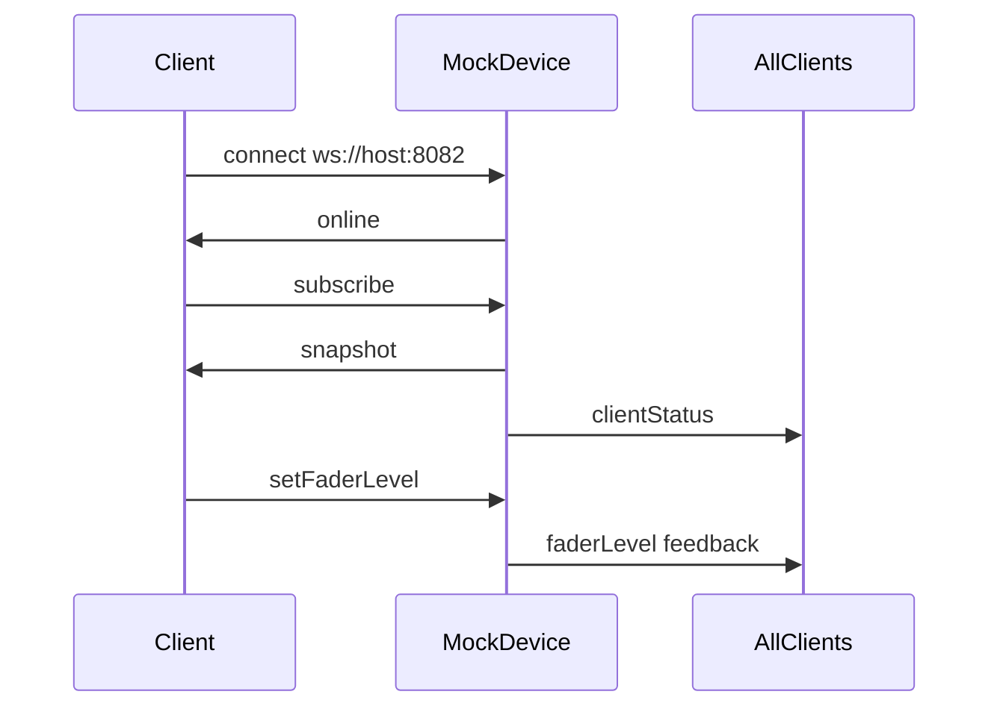

# Device Protocol (v1)

WebSocket JSON protocol for **sisyfos-mock-device**. This is the wire-level API consumed by any client: the debug Web UI, wscat, test harnesses, and the Sisyfos plugin adapter.

For Sisyfos-specific integration (`MixerConnection` mapping, Redux feedback), see **[sisyfos-mixer-connection.md](sisyfos-mixer-connection.md)**.

**Protocol version:** v1  
**Default endpoint:** `ws://localhost:8082`  
**Message format:** JSON text frames, one message per frame  
**Authentication:** none

---

## Overview

The mock device holds in-memory channel state and:

- Accepts **commands** from clients
- Pushes **feedback** on every state change (broadcast to all connected clients)
- Does **not** implement PGM/PST, automation, or mixer-specific logic — that lives in clients



---

## Connection

### Endpoint

| Environment | URL                   |
| ----------- | --------------------- |
| Local dev   | `ws://localhost:8082` |
| Docker      | `ws://<host>:8082`    |
| Custom      | `WS_PORT` env var     |

### Handshake

1. Open a WebSocket connection.
2. Receive `{ "type": "online" }`.
3. Send `{ "type": "subscribe", ... }` to receive full state.
4. Listen for feedback on all subsequent changes.

### Client identification

Clients identify their role on `subscribe`:

| `clientType` | Used by                                     |
| ------------ | ------------------------------------------- |
| `"sisyfos"`  | Sisyfos plugin adapter (default if omitted) |
| `"ui"`       | Debug Web UI                                |

```json
{
    "type": "subscribe",
    "clientType": "ui"
}
```

| Field        | Type                  | Required | Description                                              |
| ------------ | --------------------- | -------- | -------------------------------------------------------- |
| `type`       | `"subscribe"`         | yes      |                                                          |
| `clientType` | `"ui"` \| `"sisyfos"` | no       | Default: `"sisyfos"`                                     |
| `channels`   | number                | no       | **Ignored in v1.** Fixed at startup via `MOCK_CHANNELS`. |

---

## Channel model

Channels are zero-indexed: `0 … N-1`. Default count: **8** (`MOCK_CHANNELS=8`).

| Field           | Type     | Range        | Default    | Description                             |
| --------------- | -------- | ------------ | ---------- | --------------------------------------- |
| `index`         | number   | 0…N-1        | —          | Channel index                           |
| `faderLevel`    | number   | 0.0–1.0      | `0.75`     | Fader/output level                      |
| `inputGain`     | number   | 0.0–1.0      | `0.75`     | Input trim/gain                         |
| `inputSelector` | number   | 1…N          | `1`        | Selected input (1-based)                |
| `mute`          | boolean  | —            | `false`    | Mute state                              |
| `pfl`           | boolean  | —            | `false`    | PFL state                               |
| `amixOn`        | boolean  | —            | `false`    | A-mix bus state                         |
| `nextAuxLevel`  | number   | 0.0–1.0      | `0`        | Next-aux send level                     |
| `auxLevels`     | number[] | 0.0–1.0 each | `N` zeros  | Per-bus aux send levels (0-based index) |
| `name`          | string   | non-empty    | `"CH1"`…   | Channel label                           |
| `fx`            | number[] | 0.0–1.0 each | `22` zeros | FX levels indexed by `FxParam` (0–21)   |

Levels are clamped to `0.0–1.0`. No feedback is emitted when a command sets a value equal to the current state.

---

## Source field

State-change feedback includes `source`:

| Value        | Meaning                                                    |
| ------------ | ---------------------------------------------------------- |
| `"command"`  | Client command (default when `source` omitted on commands) |
| `"hardware"` | Web UI simulating operator desk moves                      |

Commands may include optional `"source": "command" | "hardware"`.

---

## Commands (client → device)

All commands are JSON objects with a required `type` field.

### `subscribe`

Request full state snapshot.

```json
{ "type": "subscribe", "clientType": "sisyfos" }
```

**Response:** `snapshot` to sender; `clientStatus` broadcast to all.

---

### `setFaderLevel`

```json
{ "type": "setFaderLevel", "channel": 0, "level": 0.5 }
```

| Field     | Type   | Required      |
| --------- | ------ | ------------- |
| `channel` | number | yes           |
| `level`   | number | yes (0.0–1.0) |
| `source`  | string | no            |

**Feedback:** `{ "type": "faderLevel", "channel": 0, "level": 0.5, "source": "command" }`

---

### `setInputGain`

```json
{ "type": "setInputGain", "channel": 0, "level": 0.5 }
```

| Field     | Type   | Required      |
| --------- | ------ | ------------- |
| `channel` | number | yes           |
| `level`   | number | yes (0.0–1.0) |
| `source`  | string | no            |

**Feedback:** `{ "type": "inputGain", "channel": 0, "level": 0.5, "source": "command" }`

---

### `setInputSelector`

```json
{ "type": "setInputSelector", "channel": 0, "selected": 2 }
```

| Field      | Type   | Required          |
| ---------- | ------ | ----------------- |
| `channel`  | number | yes               |
| `selected` | number | yes (integer 1…N) |
| `source`   | string | no                |

Valid range for `selected` is `1` through `inputSelectorCount` from the snapshot (default **4**, set via `MOCK_INPUT_SELECTORS`).

**Feedback:** `{ "type": "inputSelector", "channel": 0, "selected": 2, "source": "command" }`

---

### `setMute`

```json
{ "type": "setMute", "channel": 0, "mute": true }
```

**Feedback:** `{ "type": "mute", "channel": 0, "mute": true, "source": "command" }`

---

### `setPfl`

```json
{ "type": "setPfl", "channel": 0, "pfl": true }
```

**Feedback:** `{ "type": "pfl", "channel": 0, "pfl": true, "source": "command" }`

---

### `setAMix`

```json
{ "type": "setAMix", "channel": 0, "amixOn": true }
```

| Field     | Type    | Required |
| --------- | ------- | -------- |
| `channel` | number  | yes      |
| `amixOn`  | boolean | yes      |
| `source`  | string  | no       |

**Feedback:** `{ "type": "amixOn", "channel": 0, "amixOn": true, "source": "command" }`

---

### `setNextAux`

```json
{ "type": "setNextAux", "channel": 0, "level": 0.25 }
```

**Feedback:** `{ "type": "nextAux", "channel": 0, "level": 0.25, "source": "command" }`

---

### `setAuxLevel`

Set a per-bus aux send level (distinct from `setNextAux`).

```json
{ "type": "setAuxLevel", "channel": 0, "auxIndex": 1, "level": 0.5 }
```

| Field      | Type   | Required             |
| ---------- | ------ | -------------------- |
| `channel`  | number | yes                  |
| `auxIndex` | number | yes (0-based, 0…N-1) |
| `level`    | number | yes (0.0–1.0)        |
| `source`   | string | no                   |

Valid range for `auxIndex` is `0` through `auxSendCount - 1` from the snapshot (default **4**, set via `MOCK_AUX_SENDS`).

**Feedback:** `{ "type": "auxLevel", "channel": 0, "auxIndex": 1, "level": 0.5, "source": "command" }`

---

### `setChannelName`

```json
{ "type": "setChannelName", "channel": 0, "name": "Host Mic" }
```

Name is trimmed; empty names are rejected.

**Feedback:** `{ "type": "channelName", "channel": 0, "name": "Host Mic", "source": "command" }`

---

### `setFx`

Set a normalized FX parameter (mirrors Sisyfos `FxParam` enum, 0–21).

```json
{ "type": "setFx", "channel": 0, "fxParam": 12, "level": 0.5 }
```

| Field     | Type   | Required                    |
| --------- | ------ | --------------------------- |
| `channel` | number | yes                         |
| `fxParam` | number | yes (0–21, see table below) |
| `level`   | number | yes (0.0–1.0)               |
| `source`  | string | no                          |

**Feedback:** `{ "type": "fx", "channel": 0, "fxParam": 12, "level": 0.5, "source": "command" }`

#### FxParam index reference

| Index | Name                       | Category                                |
| ----- | -------------------------- | --------------------------------------- |
| 0–3   | `EqGain01`–`EqGain04`      | EQ band gain                            |
| 4–7   | `EqFreq01`–`EqFreq04`      | EQ band frequency                       |
| 8–11  | `EqQ01`–`EqQ04`            | EQ band Q                               |
| 12    | `DelayTime`                | Delay                                   |
| 13    | `GainTrim`                 | Input trim                              |
| 14–20 | `CompThrs` … `CompRelease` | Compressor                              |
| 21    | `CompOnOff`                | Compressor on/off (0.0 = off, 1.0 = on) |

---

### `resetAll`

Reset all channels to defaults. Used by the Web UI.

```json
{ "type": "resetAll" }
```

**Feedback:** one message per changed field per channel.

---

### `loadMixerPreset`

Load a JSON preset file from disk and apply channel state. Only channels listed in the preset are updated; others are left unchanged.

```json
{ "type": "loadMixerPreset", "presetName": "show-ready.json" }
```

| Field        | Type   | Required                           |
| ------------ | ------ | ---------------------------------- |
| `presetName` | string | yes (filename in preset directory) |
| `source`     | string | no                                 |

The `.json` extension is optional — `show-ready` resolves to `show-ready.json`.

Preset files live in the directory configured by `MOCK_PRESET_DIR` (default: `./storage`). Path traversal in `presetName` is rejected.

**Preset file format:**

```json
{
    "name": "Show Ready",
    "channels": [
        {
            "index": 0,
            "faderLevel": 0.85,
            "inputGain": 0.75,
            "inputSelector": 1,
            "mute": false,
            "pfl": false,
            "amixOn": false,
            "nextAuxLevel": 0,
            "auxLevels": [0, 0.25, 0, 0],
            "name": "Host Mic",
            "fx": [
                0, 0, 0, 0, 0, 0, 0, 0, 0, 0, 0, 0, 0, 0, 0, 0, 0, 0, 0, 0, 0, 0
            ]
        }
    ]
}
```

Each channel entry uses the same fields as snapshot channels. `auxLevels` and `fx` arrays are padded or truncated to match device configuration.

**Feedback:** one message per changed field per updated channel, followed by:

```json
{ "type": "presetLoaded", "presetName": "show-ready.json", "source": "command" }
```

On failure (missing file, invalid JSON, validation error): `{ "type": "error", "message": "..." }`.

---

### `ping`

```json
{ "type": "ping", "id": "optional-id" }
```

**Response (sender only):** `{ "type": "pong", "id": "optional-id" }`

---

## Device messages (device → client)

### `online`

Sent once on connect, followed immediately by the current `clientStatus`.

```json
{ "type": "online", "online": true }
```

---

### `snapshot`

Full state, sent to the subscribing client.

```json
{
    "type": "snapshot",
    "online": true,
    "inputSelectorCount": 4,
    "auxSendCount": 4,
    "channels": [
        {
            "index": 0,
            "faderLevel": 0.75,
            "inputGain": 0.75,
            "inputSelector": 1,
            "mute": false,
            "pfl": false,
            "amixOn": false,
            "nextAuxLevel": 0,
            "auxLevels": [0, 0, 0, 0],
            "name": "CH1",
            "fx": [
                0, 0, 0, 0, 0, 0, 0, 0, 0, 0, 0, 0, 0, 0, 0, 0, 0, 0, 0, 0, 0, 0
            ]
        }
    ]
}
```

---

### `clientStatus`

Broadcast when any client subscribes or disconnects.

```json
{
    "type": "clientStatus",
    "sisyfosConnected": true,
    "sisyfosClients": 1,
    "uiClients": 1,
    "totalClients": 2
}
```

---

### State feedback (broadcast)

Sent to **all** clients on every state change.

| `type`          | Payload fields                           |
| --------------- | ---------------------------------------- |
| `faderLevel`    | `channel`, `level`, `source`             |
| `inputGain`     | `channel`, `level`, `source`             |
| `inputSelector` | `channel`, `selected`, `source`          |
| `mute`          | `channel`, `mute`, `source`              |
| `pfl`           | `channel`, `pfl`, `source`               |
| `amixOn`        | `channel`, `amixOn`, `source`            |
| `nextAux`       | `channel`, `level`, `source`             |
| `auxLevel`      | `channel`, `auxIndex`, `level`, `source` |
| `channelName`   | `channel`, `name`, `source`              |
| `fx`            | `channel`, `fxParam`, `level`, `source`  |
| `presetLoaded`  | `presetName`, `source`                   |

---

### `vuLevel` (broadcast, streaming)

Simulated VU meter levels, emitted automatically on a timer (default every 50 ms). Not tied to state commands — no `source` field.

```json
{ "type": "vuLevel", "channel": 0, "level": 0.62, "vuIndex": 0 }
```

| Field     | Type   | Description                                              |
| --------- | ------ | -------------------------------------------------------- |
| `channel` | number | Channel index (maps to Sisyfos fader index)              |
| `level`   | number | Normalized meter level 0.0–1.0                           |
| `vuIndex` | number | Sub-meter index (default `0`; maps to Sisyfos `vuIndex`) |

Levels are generated internally with a sine wave. Each channel uses a different phase offset (and slightly different speed) so meters animate as distinct waves. Muted channels report `level: 0`.

Controlled by `MOCK_VU_ENABLED` (default `true`) and `MOCK_VU_INTERVAL_MS` (default `50`).

---

### `pong`

Response to `ping` (sender only).

---

### `error`

Invalid command; connection stays open.

```json
{ "type": "error", "message": "Invalid channel index: 8" }
```

| Message                             | Cause               |
| ----------------------------------- | ------------------- |
| `Invalid JSON`                      | Malformed body      |
| `Message must include a type field` | Missing `type`      |
| `Missing or invalid <field>`        | Wrong/missing field |
| `Invalid channel index: N`          | Out of range        |
| `Channel name cannot be empty`      | Blank name          |
| `Invalid source: …`                 | Bad `source` value  |
| `Invalid clientType: …`             | Bad `clientType`    |
| `Unknown command type: …`           | Unsupported command |

---

## Example session

```bash
npx wscat -c ws://localhost:8082
```

```
< {"type":"online","online":true}
> {"type":"subscribe"}
< {"type":"snapshot","online":true,"channels":[...]}
< {"type":"clientStatus","sisyfosConnected":true,"sisyfosClients":1,"uiClients":0,"totalClients":1}
> {"type":"setFaderLevel","channel":0,"level":0.5}
< {"type":"faderLevel","channel":0,"level":0.5,"source":"command"}
> {"type":"ping","id":"1"}
< {"type":"pong","id":"1"}
```

---

## Configuration

| Variable               | Default     | Effect                                               |
| ---------------------- | ----------- | ---------------------------------------------------- |
| `WS_PORT`              | `8082`      | WebSocket port                                       |
| `MOCK_CHANNELS`        | `8`         | Channel count and valid index range                  |
| `MOCK_INPUT_SELECTORS` | `4`         | Number of selectable inputs per channel (1-based)    |
| `MOCK_AUX_SENDS`       | `4`         | Number of aux send buses per channel (0-based index) |
| `MOCK_PRESET_DIR`      | `./storage` | Directory containing JSON mixer preset files         |
| `MOCK_VU_ENABLED`      | `true`      | Enable simulated VU meter streaming                  |
| `MOCK_VU_INTERVAL_MS`  | `50`        | VU update interval in milliseconds (min 16)          |
| `HTTP_PORT`            | `8081`      | Static UI + health endpoint                          |

---

## HTTP health endpoint

```
GET http://localhost:8081/health
```

```json
{
    "ok": true,
    "clients": 2,
    "sisyfosConnected": true,
    "sisyfosClients": 1
}
```

### `GET /presets`

List available preset filenames:

```json
{ "presets": ["all-muted.json", "show-ready.json"] }
```

---

## Out of scope (v1)

Unsupported commands return `{ "type": "error", ... }`:

- Inject command
- Authentication
- Runtime channel count changes

