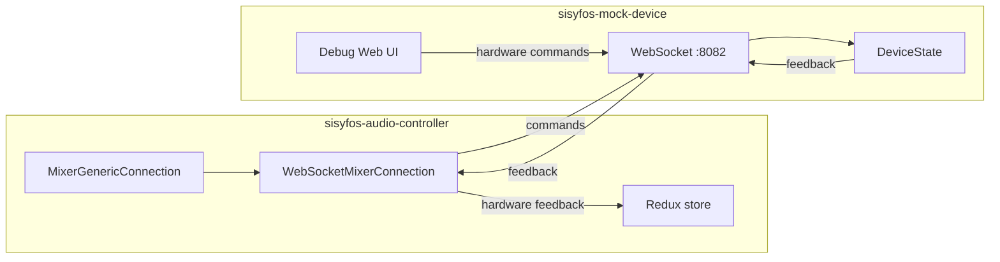
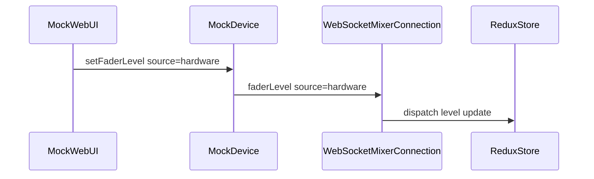

# Sisyfos Mixer Connection

Guide for implementing a **WebSocket `MixerConnection`** in [sisyfos-audio-controller](https://github.com/tv2norge-collab/sisyfos-audio-controller) that talks to **sisyfos-mock-device**.

Wire protocol details (message schemas, errors, examples) are in **[internal-api.md](internal-api.md)**.

---

## Role in the architecture

Sisyfos is the smart middleware — it owns PGM/PST logic, fades, automation, and Redux state. The mock device is a dumb endpoint that only stores and reports per-channel fader, mute, PFL, next-aux, and name.



The adapter implements the existing `MixerConnection` interface:

```typescript
// server/src/utils/mixerConnections/index.ts
export interface MixerConnection {
    loadMixerPreset(presetName: string): void
    updateInputGain(channelIndex: number, level: number): void
    updateInputSelector(channelIndex: number, inputSelected: number): void
    updatePflState(channelIndex: number): void
    updateMuteState(channelIndex: number, muteOn: boolean): void
    updateAMixState(channelIndex: number, aMixOn: boolean): void
    updateNextAux(channelIndex: number, level: number): void
    updateFx(channelIndex: number, fxParam: FxParam, level: number): void
    updateAuxLevel(channelIndex: number, auxSendIndex: number, level: number): void
    updateChannelName(channelIndex: number): void
    injectCommand(command: string[]): void
    updateChannelSetting(channelIndex: number, setting: string, value: string): void
    updateFadeIOLevel(channelIndex: number, outputLevel: number): void
}
```

Reference implementation pattern: `OscMixerConnection` — especially incoming fader/gain feedback with `source: "hardware"`.

---

## Configuration

The adapter needs one setting: the mock device WebSocket URL.

| Setting | Example | Description |
|---------|---------|-------------|
| `deviceUrl` | `ws://localhost:8082` | WebSocket endpoint (exact key TBD in Sisyfos settings schema) |

Future mixer preset key (suggested): `mockWebSocket`.

Environment on the mock side:

| Variable | Default |
|----------|---------|
| `WS_PORT` | `8082` |
| `MOCK_CHANNELS` | `8` |

Channel count in Sisyfos must match `MOCK_CHANNELS`, or the adapter must map indices explicitly.

---

## Connection lifecycle

1. **Connect** to `deviceUrl` on mixer startup.
2. **Wait** for `{ "type": "online" }`.
3. **Subscribe** as a Sisyfos client:

   ```json
   { "type": "subscribe", "clientType": "sisyfos" }
   ```

4. **Receive** `{ "type": "snapshot" }` — optional initial sync (Redux is usually authoritative; adapter may ignore snapshot and only push commands).
5. **Listen** for feedback messages for the lifetime of the connection.
6. **Reconnect** and re-subscribe on WebSocket close (mirror OSC reconnect behaviour).

Optionally send periodic `{ "type": "ping" }` and expect `{ "type": "pong" }` for health checks.

---

## Outbound: `MixerConnection` → device commands

The adapter translates method calls to WebSocket commands. **Do not** set `source` on outbound commands — the device defaults to `"command"`.

| `MixerConnection` method | Device command | Mapping notes |
|--------------------------|----------------|---------------|
| `updateFadeIOLevel(ch, level)` | `setFaderLevel` | `level` is 0.0–1.0 output level |
| `updateInputGain(ch, level)` | `setInputGain` | `level` is 0.0–1.0 input trim |
| `updateInputSelector(ch, selected)` | `setInputSelector` | `selected` is 1-based input index |
| `updateMuteState(ch, muteOn)` | `setMute` | Direct boolean map |
| `updatePflState(ch)` | `setPfl` | Read current PFL from Redux; send `{ pfl: boolean }` |
| `updateAMixState(ch, aMixOn)` | `setAMix` | Send `{ amixOn: boolean }` |
| `updateNextAux(ch, level)` | `setNextAux` | `level` is 0.0–1.0 |
| `updateAuxLevel(ch, auxIndex, level)` | `setAuxLevel` | `auxIndex` is 0-based; `level` is 0.0–1.0 |
| `updateFx(ch, fxParam, level)` | `setFx` | `fxParam` is 0–21 (`FxParam` enum); `level` is 0.0–1.0 |
| `updateChannelName(ch)` | `setChannelName` | Read label from Redux/store; send `{ name: string }` |
| `loadMixerPreset(name)` | `loadMixerPreset` | Send `{ presetName: string }` — filename in device preset directory |
| `injectCommand` | — | **No-op** |
| `updateChannelSetting` | — | **No-op** |

### Example translations

```typescript
// updateFadeIOLevel(0, 0.5)
ws.send(JSON.stringify({ type: 'setFaderLevel', channel: 0, level: 0.5 }))

// updateInputGain(0, 0.6)
ws.send(JSON.stringify({ type: 'setInputGain', channel: 0, level: 0.6 }))

// updateInputSelector(0, 2)
ws.send(JSON.stringify({ type: 'setInputSelector', channel: 0, selected: 2 }))

// updateMuteState(2, true)
ws.send(JSON.stringify({ type: 'setMute', channel: 2, mute: true }))

// updatePflState(1) — read Redux first
const pflOn = /* fader.pflOn from store */
ws.send(JSON.stringify({ type: 'setPfl', channel: 1, pfl: pflOn }))

// updateAMixState(0, true)
ws.send(JSON.stringify({ type: 'setAMix', channel: 0, amixOn: true }))

// updateNextAux(3, 0.25)
ws.send(JSON.stringify({ type: 'setNextAux', channel: 3, level: 0.25 }))

// updateAuxLevel(0, 1, 0.5) — aux bus index 1
ws.send(JSON.stringify({ type: 'setAuxLevel', channel: 0, auxIndex: 1, level: 0.5 }))

// updateFx(0, FxParam.DelayTime, 0.5)
ws.send(JSON.stringify({ type: 'setFx', channel: 0, fxParam: 12, level: 0.5 }))

// updateChannelName(0) — read label from store
const name = /* channel label from store */
ws.send(JSON.stringify({ type: 'setChannelName', channel: 0, name }))

// loadMixerPreset('show-ready.json')
ws.send(JSON.stringify({ type: 'loadMixerPreset', presetName: 'show-ready.json' }))
```

---

## Inbound: device feedback → Redux

All state-change feedback is broadcast. The adapter should handle messages where `source === "hardware"` — these represent operator moves on the mock desk UI and must flow back into Sisyfos state, similar to OSC fader feedback in `OscMixerConnection`.

Feedback with `source === "command"` confirms state after an adapter-issued command. Ignore if Redux is already authoritative, or use for echo verification.

| Feedback `type` | Condition | Sisyfos action |
|-----------------|-----------|----------------|
| `faderLevel` | `source: "hardware"` | Dispatch fader level update for `channel` |
| `inputGain` | `source: "hardware"` | Dispatch input gain update for `channel` |
| `inputSelector` | `source: "hardware"` | Dispatch input selector update for `channel` |
| `mute` | `source: "hardware"` | Dispatch mute update for `channel` |
| `pfl` | `source: "hardware"` | Dispatch PFL update for `channel` |
| `amixOn` | `source: "hardware"` | Dispatch A-mix update for `channel` |
| `nextAux` | `source: "hardware"` | Dispatch next-aux level for `channel` |
| `auxLevel` | `source: "hardware"` | Dispatch aux send level for `channel` + `auxIndex` |
| `fx` | `source: "hardware"` | Dispatch FX update for `channel` + `fxParam` |
| `channelName` | `source: "hardware"` | Dispatch channel label for `channel` |
| `presetLoaded` | any | Optional log/ack after preset recall (`presetName`) |
| `vuLevel` | always | `sendVuLevel(channel, VuType.Channel, vuIndex ?? 0, level)` |
| `faderLevel` | `source: "command"` | Optional echo verify; usually ignore |
| `online` | — | Mark mixer online |
| `snapshot` | — | Optional initial sync |
| `clientStatus` | — | Ignore (UI concern) |
| `error` | — | Log; connection stays open |
| `pong` | — | Health check response |

### Hardware feedback flow



Mirror the OSC pattern: when the physical (or simulated) desk moves a fader, Sisyfos Redux must reflect it so PGM/PST logic stays consistent.

---

## Methods with special adapter logic

### `updatePflState(channelIndex)`

The `MixerConnection` interface only passes `channelIndex` — no boolean. The adapter must read the target PFL state from Redux (as `OscMixerConnection` reads fader state) and send an explicit `pfl` value:

```json
{ "type": "setPfl", "channel": 1, "pfl": true }
```

### `updateAMixState(channelIndex, aMixOn)`

Maps directly. Boolean A-mix bus state matching Redux `amixOn`.

```json
{ "type": "setAMix", "channel": 0, "amixOn": true }
```

### `updateChannelName(channelIndex)`

Same pattern — read the channel label from Redux/store and send:

```json
{ "type": "setChannelName", "channel": 0, "name": "Host Mic" }
```

### `updateInputGain(channelIndex, level)`

Maps directly. Normalized 0.0–1.0 input trim level, matching Redux `inputGain` storage.

```json
{ "type": "setInputGain", "channel": 0, "level": 0.6 }
```

### `updateInputSelector(channelIndex, inputSelected)`

Maps directly. 1-based input index matching Redux `inputSelector` storage. Valid range is `1`…`inputSelectorCount` from the device snapshot.

```json
{ "type": "setInputSelector", "channel": 0, "selected": 2 }
```

### `updateFx(channelIndex, fxParam, level)`

Maps directly. `fxParam` uses the Sisyfos `FxParam` enum (0–21). Levels are normalized 0.0–1.0, matching Redux fader FX storage.

```json
{ "type": "setFx", "channel": 0, "fxParam": 12, "level": 0.5 }
```

Hardware feedback from the mock UI uses the same shape with `source: "hardware"`.

### `updateFadeIOLevel(channelIndex, outputLevel)`

Maps directly. Sisyfos computes the output level (PGM/PST crossfade result); the mock stores it as the channel fader position.

### `updateAuxLevel(channelIndex, auxSendIndex, level)`

Maps directly. `auxSendIndex` is 0-based (matches Sisyfos `auxIndex`). Levels are normalized 0.0–1.0.

```json
{ "type": "setAuxLevel", "channel": 0, "auxIndex": 1, "level": 0.5 }
```

Note: `updateNextAux` and `updateAuxLevel` are separate — next-aux is a single preview send; aux levels are the full per-bus send array.

### `loadMixerPreset(presetName)`

Maps directly. The adapter passes the preset filename as stored in Sisyfos (same convention as OSC/Ember mixers reading from `STORAGE_FOLDER`).

```json
{ "type": "loadMixerPreset", "presetName": "show-ready.json" }
```

The device loads JSON from its preset directory (`MOCK_PRESET_DIR`, default `./storage`), applies each channel entry, emits per-field feedback, then `presetLoaded`. Channels not listed in the preset file are unchanged.

### VU meters (inbound streaming)

The device emits `vuLevel` messages on a timer — no Sisyfos command required. Map each message to `sendVuLevel`:

```typescript
import { VuType } from '../../../shared/src/utils/vu-server-types'

// inbound: { type: 'vuLevel', channel: 0, level: 0.62, vuIndex: 0 }
sendVuLevel(message.channel, VuType.Channel, message.vuIndex ?? 0, message.level)
```

Levels are a simulated sine wave with per-channel phase offset. Muted channels stream `0`.

### `updateNextAux(channelIndex, level)`

Maps directly. Used when Sisyfos drives the next-aux send preview level.

---

## Implementation checklist

- [ ] Create `WebSocketMixerConnection` implementing `MixerConnection`
- [ ] Read `deviceUrl` from mixer settings
- [ ] Connect WebSocket on construction / mixer enable
- [ ] On `open`: wait for `online`, send `subscribe` with `clientType: "sisyfos"`
- [ ] Implement outbound mapping for the eleven supported methods (table above)
- [ ] No-op stub for all other `MixerConnection` methods
- [ ] Parse inbound JSON; route `source: "hardware"` feedback to Redux dispatches
- [ ] Set mixer online on connect; offline on close (see `OscMixerConnection` `SET_MIXER_ONLINE`)
- [ ] Reconnect with backoff on unexpected close
- [ ] Optional: `ping`/`pong` keepalive
- [ ] Register in mixer connection factory alongside OSC, vMix, etc.

---

## Testing against the mock

```bash
# Terminal 1 — mock device
yarn dev

# Terminal 2 — simulate Sisyfos commands
npx wscat -c ws://localhost:8082
> {"type":"subscribe","clientType":"sisyfos"}
> {"type":"setFaderLevel","channel":0,"level":0.5}
```

Use the Web UI at http://localhost:5173 to simulate hardware moves (`source: "hardware"`) and verify the adapter dispatches Redux updates.

Run mock device protocol tests:

```bash
yarn test
```

---

## v1 limitations

The mock does not support these Sisyfos features — adapter methods should no-op:

- Inject command, channel settings
- Authentication

Sending unsupported command types to the mock returns `{ "type": "error", ... }`.

---

## Related docs

- **[internal-api.md](internal-api.md)** — full WebSocket message reference
- **Sisyfos `MixerConnection`** — `server/src/utils/mixerConnections/index.ts`
- **OSC reference** — `server/src/utils/mixerConnections/OscMixerConnection.ts`
